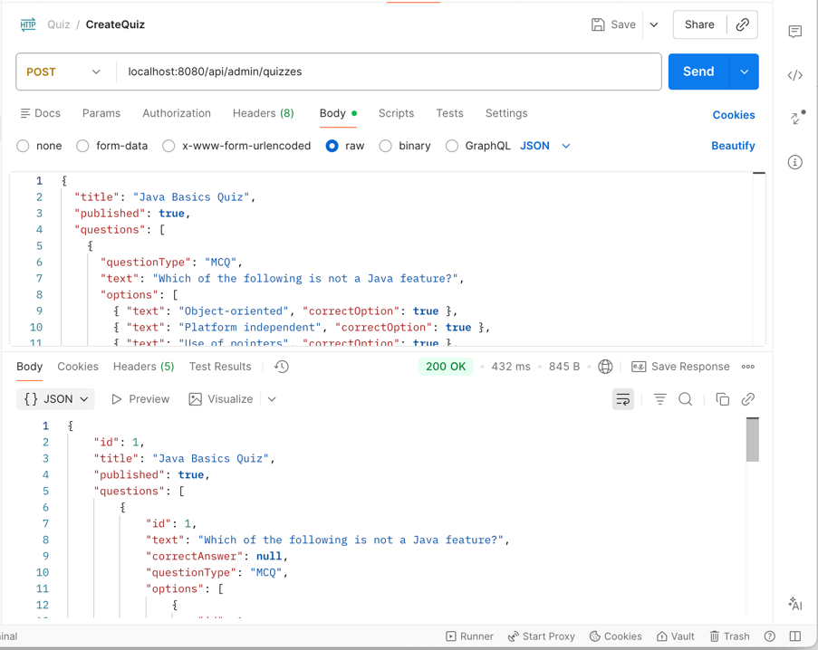
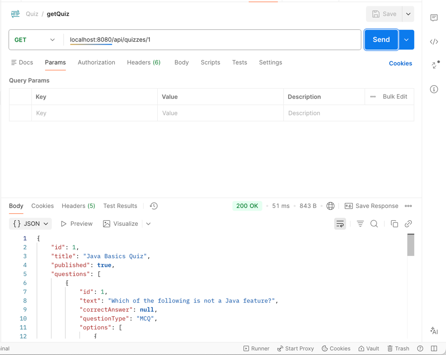
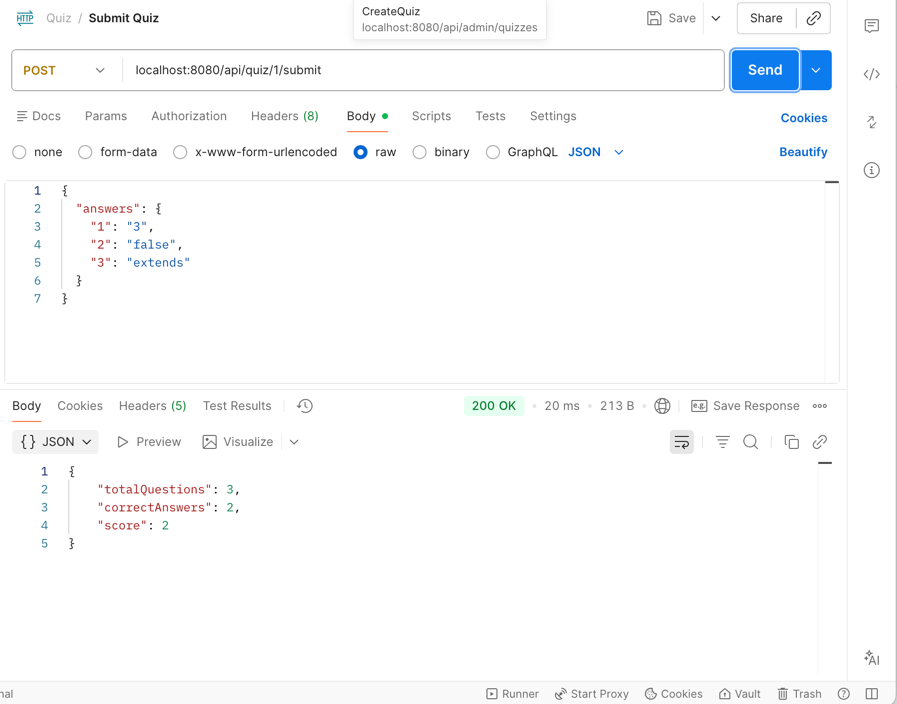

# Quiz Management System

A simple, production-ready **Quiz Management System** that allows an admin to create quizzes and users to take quizzes publicly and view results instantly.

---

## 🚀 Features

### Admin

* Create quizzes with a title
* Add multiple questions per quiz
* Supported question types:

    * Multiple Choice (MCQ)
    * True / False
    * Text-based answers
* Define correct answers

### Public Users

* Access quizzes via public API
* Take quiz without login
* Submit answers
* View score immediately after submission

---

## 🧱 Tech Stack

* **Backend**: Java 17, Spring Boot, Spring Data JPA
* **Database**: H2
* **API Documentation**: Swagger (OpenAPI)
* **Build Tool**: Maven

---

## 📂 Project Structure (Backend)

```
quiz-service
 ├── controller
 ├── service
 ├── repository
 ├── entity
 ├── dto
 └── QuizApplication.java
```

---

## 🔗 API Documentation (Swagger)

Once the backend is running, Swagger UI is available at:

👉 **[http://localhost:8080/swagger-ui/index.html](http://localhost:8080/swagger-ui/index.html)**

All APIs can be tested directly from Swagger.

---

## 🔌 APIs Overview

### Admin API

* **Create Quiz**
  `POST /api/admin/quizzes`

### Public APIs

* **Get Quiz**
  `GET /api/quizzes/{quizId}`

* **Submit Quiz**
  `POST /api/quiz/{quizId}/submit`

---

## 🧪 API Testing

* APIs were tested using **Postman**
* Postman request & response screenshots are attached for reference
* Swagger UI can also be used for live testing

---

## ▶️ How to Run

### Backend

1. Clone the repository
2. Configure MySQL connection in `application.yml`
3. Run the Spring Boot application

```
mvn spring-boot:run
```

Backend will start at:

```
http://localhost:8080
```

## 📸 Demo & Screenshots

* Postman API screenshots attached
* Swagger UI demo included
* End-to-end flow demonstrated:

    * Quiz creation
        
    * Quiz retrieval
        
    * Submission and scoring
        

---

## 📝 Notes & Design Decisions

* Authentication is intentionally kept out of scope
* DTOs are used to avoid exposing entities and correct answers
* Scoring logic is handled server-side
* System is stateless and scalable

---

## 🔮 Future Enhancements

* Authentication & role-based access
* Timed quizzes
* Quiz attempt history
* Deployment with Docker & CI/CD

---

## 👤 Author

**Girish K J**

---

✅ This project was built as a scoped, production-quality assignment focusing on correctness, clarity, and clean architecture.
